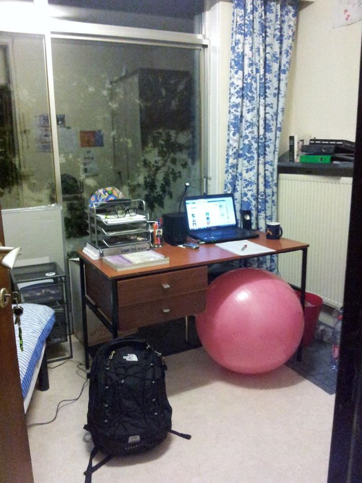
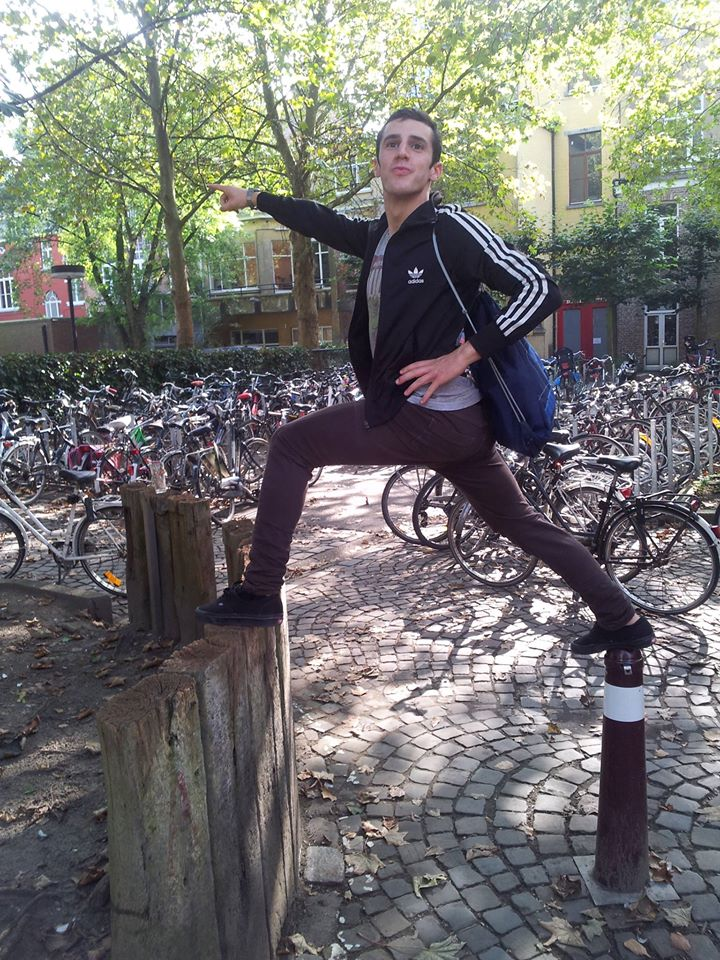
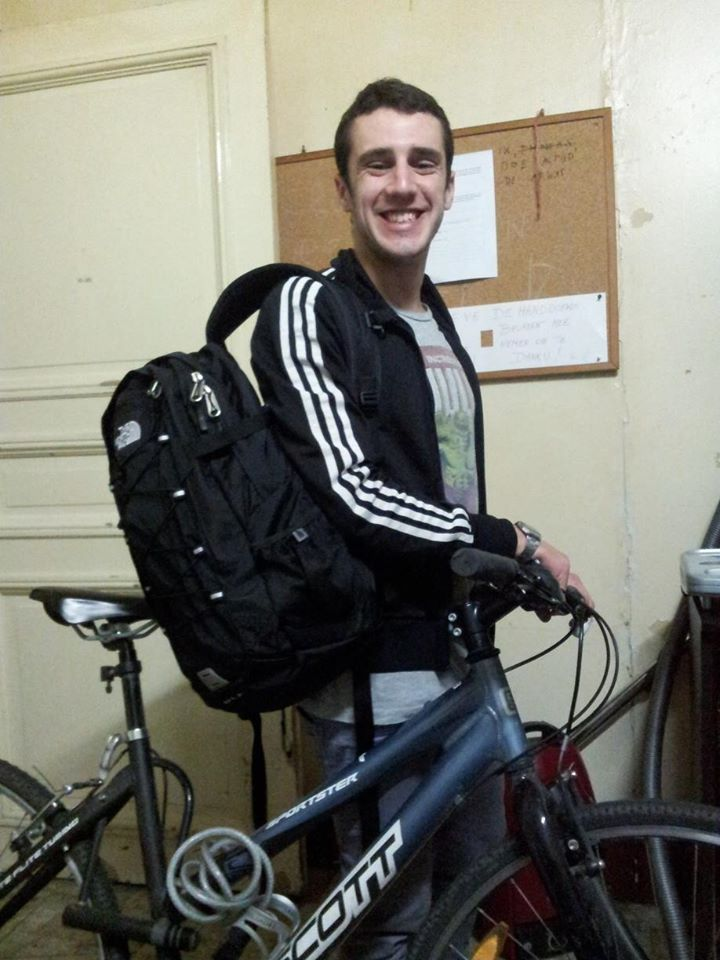
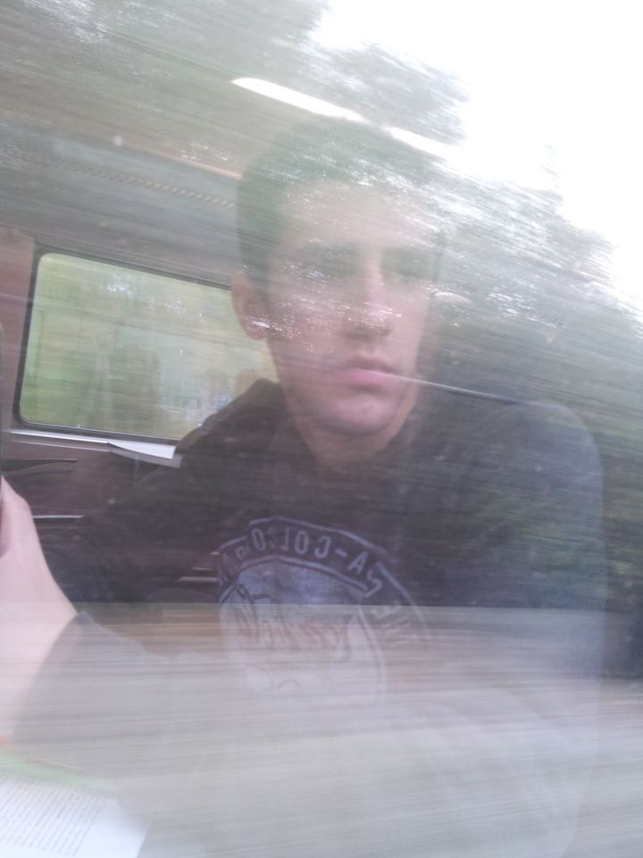
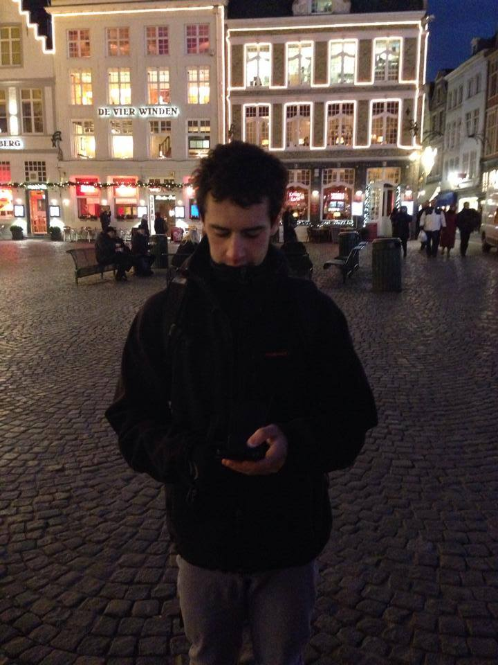

# Arrival (September) {-#arrival}

These are mostly a compilation of the entries of the first (traveling) blog I made, [*Excusas para no Volver*](http://excusasparanovolver.blogspot.com/)^[*Excuses for not coming back*. Not coming back to my home country? Not coming back to the visited country? ]. I hadn’t started writing letters yet, just some spare emails that reflected of my situation. I used to do some online courses; exchange information and links with my friends T. (a philosopher), and F. (a poet); and all those things last year weird university students do. 

They may not be so relevant nowadays, but I still think that it adds some layer of clarity over the person that I used to be and my evolution as a writer. 

## 2013-09-04 From and to F. {-#fromtoF20130904}

Little fagot things...

[Russian athletes](https://en.wikipedia.org/wiki/Kseniya_Ryzhova#2013_Moscow_kiss) first, [now](http://www.elmundo.es/elmundo/2013/09/03/gentes/1378227703.html) [Delon](https://en.wikipedia.org/wiki/Alain_Delon). France and Russia are resisting They believed in the Revolution, which is a serious thing, and that is why he faces these little fagot things. Let's see if we lose the fear of what correctness. If homosexuals want to exist, they exist, what are they going to do. But do not tell us that it’s normal. The most extended neither, of course not. And in favor of nature, of course neither do they go.

F.

----

Cats didn't purr? I only see scratches and bites around here ...

F., analysis, analysis!!!!

I will only make statements:

1. Origin of homosexuality. Mainly, it is believed to have a [genetic origin]( https://en.wikipedia.org/wiki/Homosexuality#Causes). Then it is no longer so against nature, since it’s nature that creates it spontaneously. In fact, in [other species there is homosexuality](https://en.wikipedia.org/wiki/Homosexuality#Homosexual_behavior_in_other_animals), but only in the human species is [homophobia]( https://en.wikipedia.org/wiki/Homophobia).

2. While it is true that it is not something that brings new offspring to the species, as human beings, they must be respected, and offensive comments such as "unnatural" is not respect. Furthermore, the bad thing about these comments is not the words, but the attitudes and the possible consequences and repercussions that these may have in this social sector.

3. The creation of a [law against homosexual propaganda](https://en.wikipedia.org/wiki/Russian_gay_propaganda_law) is a restriction of a right and freedom that is not harmful to the population, and that causes negative discrimination in these citizens.

4. Although it is not the "normal" or the most widespread tendency, homosexuals are human beings in the same way as the others, and they must be treated as such. I know many homosexuals who are beautiful people, and they have taught me to love (love is a very big word, you know) men more even than women, but in a different ways.

And as a typical and topical example, [homosexuality practiced by the Greeks of Classical Greece]( https://en.wikipedia.org/wiki/Homosexuality#Classical_period), the cradle of some of the greatest thinkers in the West.

F., do not take the email as an attack on your ideas, I like that you share this information with me, because they connect me with a reality and a society with which I often disconnect. But what I am going to like the most is what T. will answer, and the probable article in [Último Cero](http://ultimocero.com/) that he is going to write.
 
With love from man to man,

Carlos, The goody-goody.

----

Carlos, 

1. Nature also creates cancers.

2. Everyone must be respected. Against nature is equivalent to say that it is not in favor of sustaining the world, it is not in favor of evolution, of conception. Let's take a radical example: tomorrow we all become homosexual. The Earth, after a few years, as long as science doesn't give up creating little children out of nothing, would become extinct. But they are few and we can continue to manage.

3. I notice a gay fashion. I'm not uncomfortable with others taking out a banner against it. I enjoy.

4. I also know excellent homosexuals.

5. Homosexuality in Greece was above all vice, pleasure, sex, desire. Here, it is presented equated to heterosexuality.

Howls.

----

C., with whom in the end you are going to have a lot in common, uses a term that we make us laugh. "*Tree*", he calls a large number of people: *trees*. People without curiosity, with little motivation. Trees like to take root. You water them from time to time, they get the sun, they do photosynthesis and they live so happy wherever you plant them.

He believes that the danger is in the trees, and not in technology or science. It is the trees that are dangerous, those that can misinterpret ideas, and unleash terrible acts. I do not believe in goody-goody philosophies, because I know the enormous human stupidity. That is the real danger of radical and extremist ideas, and more so when they go against a sector of the population.

I am not so scared or too disturbed about educated people with the capacity to defend ideas I don’t share about homosexuality, politics, etc.. It disturbs me more how trees can interpret these ideas. Worst of all, trees here are not fixed to the ground by roots. Their branches have access to a technology that can be very harmful ...

Purrs 

PS: I have [*Old Possum's Book of Practical Cats*](https://en.wikipedia.org/wiki/Old_Possum%27s_Book_of_Practical_Cats) at home [@eliot2014old]. I bought it in London last year. You live less than two minutes distance by bike, and 5 walking. Don’t force me to bring it to you. 

---

> I begin this review with the famous, and polemical, declaration by T. S. Eliot. Although it is only some sixty-seven years since he published, in 1948, his essay Notes Towards the Definition of Culture, when we reread it today, it seems to refer to a very remote era, without any connection to the present.
>
>T. S. Eliot assures us that his aim is merely to help define the concept of culture, but, in fact, his ambition is much greater, for, as well as specifying what the term means, he offers a penetrating criticism of the cultural system of his time, which, according to him, is becoming ever more distant from the ideal model that it represented in the past. In a sentence that might have appeared excessive at the time of writing, he argues, ‘I see no reason why the decay of culture should not proceed much further, and why we may not even anticipate a period, of some duration, of which it will be possible to say that it will have no culture.’1 (Anticipating my argument in Notes on the Death of Culture, I will say that the period Eliot is referring to is the one in which we are now living.)
>
>That ideal older model, according to Eliot, is a culture made up of three ‘senses’ of the term: the individual, the group or class, and the whole society. While there is some interaction between these three areas, each maintains a certain autonomy and develops in a state of constant tension with the others, within an order that allows the whole of society to prosper and maintain its cohesiveness.
>
>T. S. Eliot states that what he calls ‘higher culture’ is the domain of an elite, and he justifies this by asserting that ‘it is an essential condition of the preservation of the quality of the culture of a minority, that it should continue to be a minority culture’ (p. 107). Like the elite, social class is also a reality that must be maintained, because the caste or group that guarantees higher culture is drawn from these ranks, an elite that should not be completely identified with the privileged group or aristocracy from which most of its members are drawn. Each class has the culture that it produces and that is appropriate to it and although, naturally, these cultures coexist, there are also marked differences that have to do with the economic conditions of each. One cannot conceive of an identical aristocratic and rural culture, for example, even though both classes share many things, such as religion and language.
>
>Eliot’s idea of class is not rigid or impermeable; rather it is open. A person from one class can move up or down a class, and it is good that this happens, even though it is an exception rather than the rule. This system both guarantees and expresses a social order, but today this order is fractured, which creates uncertainty about the future. The naive idea that, through education, one can transmit culture to all of society is destroying ‘higher culture’, because the only way of achieving this universal democratization of culture is by impoverishing culture, making it ever more superficial. Just as the elite is indispensable to Eliot’s conception of ‘higher culture’, so also it is fundamental that a society has regional cultures that both nurture national culture and also exist in their own right with a certain degree of independence. ‘It is important that a man should feel himself to be not merely a citizen of a particular nation, but a citizen of a particular part of his country, with local loyalties. These, like loyalty to class, arise out of loyalty to the family’ (p. 52).

---

*Notes on the Death of Culture* – Vargas LLosa [@llosa2015notes]

Noted. 

Forceful low hitting… I guess that you’ll have an unfinished and unfinishable list. 

Still, it may be that current times are not the right path, but the past wasn't either.

Think of T.'s father. Let’s believe (1^st^ plural from of the imperative of believe, not recognized in the [RSA]( https://en.wikipedia.org/wiki/Royal_Spanish_Academy) dictionary^[Spanish nuance: *Creamos* can be the imperative form of *creer* [Let’s believe] or present of *crear* [We create] ]) in opportunities. (Goody-goody striking back...)

----

You have protection, so hits don't hurt. Well seen the title. A title that I have praised as much as criticized. I retire with the angels, who will not visit me tonight.

---

Good evening, and do not underestimate the help of Google (internet, science, technology, society, collaboration, cooperation, community, trees that write empty things in blogs ...), nor overestimate my ability.

I will give your address to the angels, to see if in this way...

## 2013-09-08 To and from F {-#toF20130908}

Hi F. 

I think I sent it in your period of not responding emails. Let me know what you think about it. 

Salud,

Carlos

> I'm late for my name
>
> next to your name
>
> and to the perfect silence of all gazes,
>
> to the tireless night of adolescents.
>
> I'm late for your dance
>
> with bare legs,
>
> to the fragile memory of small events,
>
> to all the words you left in my belly.
>
> I'm late for your face
>
> so shy and perfect
>
> and to the infinite beach with your body stretched out.
>
> I'm late for the space
>
> that was waiting in your bed,
>
> to the kiss on the cheek
>
> with sleeping eyes,
>
> to my hand in your winter.
>
> I'm late to write you
>
> and love you slowly,
>
> without doubts and without temples,
>
> without counting the kisses.

Original: 

>Llego tarde a mi nombre
>
>al lado de tu nombre
>
>y al silencio perfecto de todas las miradas,
>
>a la noche incansable de los adolescentes.
>
>Llego tarde a tu baile
>
>con las piernas desnudas,
>
>a la memoria frágil de los hechos pequeños,
>
>a todas las palabras que dejaste en mi vientre.
>
>Llego tarde a tu rostro
>
>tan tímido y perfecto
>
>y a la playa infinita con tu cuerpo tendido.
>
>Llego tarde al espacio
>
>que esperaba en tu cama,
>
>al beso en la mejilla
>
>con los ojos dormidos,
>
>a mi mano en tu invierno.
>
>Llego tarde a escribirte
>
>y a quererte despacio,
>
>sin dudas y sin templos,
>
>sin contarnos los besos.
>
>[@miralpeix2005cuerpo]

----- 

Carlos, 

Frankly good. It reminds me, based on my readings, aspects admired in [Felix Grande]( https://es.wikipedia.org/wiki/F%C3%A9lix_Grande) and [Caballero Bonald]( https://en.wikipedia.org/wiki/Jos%C3%A9_Manuel_Caballero). Frankly good. Just the title -or first verse- is already worth the poem.

F. 

------   

Hi F. 

[Page 35](http://www.ccoo.cat/barcelones/documentacio/pdf_diversos/llibre_premi_Valverde_2011.pdf)

The poem chose me, it was the day, the place, and the moment ... You know that I only detect and sense ;)

Enjoy the second prize.

Carlos

## 2013-09-09 Light subterfuges^[First entry of [*Excusas para no volver*](https://excusasparanovolver.blogspot.com/2013/09/subterfugios-de-luz.html), my first travelling blog.] {-#Excusas20130909}

Surprisingly, [Ryanair](https://en.wikipedia.org/wiki/Ryanair) has arrived 35 minutes early. [Madrid](https://en.wikipedia.org/wiki/Madrid)-[Charleroi](https://en.wikipedia.org/wiki/Charleroi), (1,500 km.) From 6.30 to 8.30. Low-Cost begins its economization with our most vital and valuable resource. There are no limits to savings. If the delays are cumulative, the advances as well. Dozens of passengers may have missed the flight today because the plane was taking off too soon. In sports competitions, it’s advisable to keep the advantage. At 18:00 a plane with more than 9,000 kilometers in less than 12 hours begins to arrive late. The rush produces stumbles. Passengers, queues and impatience. Every river returns to its channel.

The cheapest way to get to Brussels from Charleroi (let no one fool you) is to take the buses from the Walloon area of Belgium, the [TEC company](https://www.infotec.be/) to Charleroi Sud Gare. The buses are at the end of the terminal, you should not leave the terminal directly, but walk towards the end and there we find the vending machines. 5€ per person [CHARLEROI Brussel South Charleroi Airport GOSSELIES (HAINAUT) - CHARLEROI Sud Gare SNCB CHARLEROI (HAINAUT)]. Later, at the South Station, if we are students under 26, we will buy a [GoPass (50€ for 10 trips) and if we are over 26 a RailPass (a bit more than 70€ for 10 trips)]( https://www.belgiantrain.be/en) This way we will get to Brussels for 10€ or 12€ depending on our age. Exquisite punctuality. At the airport we will find taxi drivers who offer the Charleroi-Brussels trip for 13€. A small price difference saves time. To the taste of the consumer.

The customer service of the Belgian train service officials is excellent. Many speak Spanish, in addition to English, French and Dutch (depending on the area); and they have no problem in providing you with a sheet of paper with the itinerary you have to follow to reach your destination. In our case, [Leuven]( https://en.wikipedia.org/wiki/Leuven).

Once in Leuven, we have been surprised by blocked streets and a slight buzz of partying. Arriving at [Grote Markt](https://en.wikipedia.org/wiki/Grote_Markt_(Leuven)) from the train station, along the Bondgenotenlaan (Avenue of the Allies), we find a picturesque scene. A bunch of Belgians, some of them independentists and a kind of parade starting at the town hall (Grote Markt). After having toured the city, a group of international students have come to Sint-Donatuspark to see a firework show. Just something to talk about. Forced introductions that will end in eternal farewells. I do not know the reasons for both, the congregation in Grote Markt and the fires in the park. I should continue investigating. I will not comment on the quality of the show, my Valencian friends would get angry.

I prefer symbolism.

The sky, black, burning and bleeding. No recoils are conceived; now they are tears. Artificial light that forcing the frowning. My face hurts. Squeaking in the calm of nature. That dark peace. Loud applause after twenty minutes of firecrackers. As a way of inauguration of my new life in this country, Belgium. Of my new life in this city, Leuven.

Now a real poem.

>Light subterfuges, lizards, list
>
>on top of the palm that creates it,
>
>invention of colors in sight,
>
>if transitory, blue, piraeus.
>
>To the greater glory of the powdermaker,
>
>straight the cane, circles plans:
>
>a whole fleeting course of geometry,
>
>beginning of its end, closed to the day.

Original 

>Subterfugios de luz, lagartos, lista
>
>encima de la palma que la crea,
>
>invención de colores a la vista,
>
>si transitoria, de azul, pirea.
>
>A la gloria mayor del polvorista,
>
>rectas la caña, círculos planea:
>
>todo un curso fugaz de geometría,
>
>principio de su fin, vedado al día.
> 
>   
> @hernandez1976perito

## 2013-09-11 To and from F {-#toF20130911}

Hello Carlos, 

I'm going to tell you a story. Since years I've been chasing a discontinued book from [Julio Llamazares](https://en.wikipedia.org/wiki/Julio_Llamazares). He started writing poetry. He dried up. He made novel. He has not republished it for the respect it deserves. No verses come out. I had a photocopy of “*The slowness of the oxen*” [@llamazares1985lentitud] and I was waiting to find it one way or another. [*Iberlibro*]( https://www.iberlibro.com/) has brought me closer to no less than the 1975 original edition. Write that one down in favor of suicide technology.

By the way, I acquired the first reissue, from 1985 in [“*Hiperión*”]( https://www.hiperion.com/), which was also there. A certain José González, allegedly in love with a certain Sara, bought it on [Gran Vía]( https://en.wikipedia.org/wiki/Gran_V%C3%ADa,_Madrid) and gave it to her, surely wanting to tell her through those poisonous pages so many things. He dated it as “*7-X-85*” with the decryption '*opos-agricultural'85-*'. Maybe she had abandoned him.

(\#fig:notas)*Valladolid (Spain). September, 2013*: The book F. was referring to.

"*The mirrors don't know how to lie anymore*,"^[*Los espejos no saben mentir*] says a song by [Diego Vasallo](https://es.wikipedia.org/wiki/Diego_Vasallo). Judged by the absolutely flawless condition, better than most of newly released books and bought in bookstores, she didn’t even open it. Probably, she must have moved out from her place, why not because of the crisis, to a smaller flat, maybe after a separation, and she would do away with part of her library.

Ellipsis.

Good luck in your days before the start of Europe.

(\#fig:poemas)*Valladolid (Spain). September, 2013*: Some poems from the book. Sorry for the lack of translation.

---

Incredible F., the life of books...

And how they know how to walk their own path, remember that you are not the final destination of that book, only a key piece in its progression. :-)

Who has found whom?

I am reading [*100 years of solitude*](https://en.wikipedia.org/wiki/One_Hundred_Years_of_Solitude). Left half finished years ago... Mastery. I think that the first chapter is quite anti-science, but we will have to wait for him to define his position, if that is what he will do.

Greetings and enjoy your long-awaited and deserved treasure.

I have to make blog posts and, even more than illicit, I will occasionally ask you for information from your huge artistic and literary culture.
 
>  *And in the memory is the origin of self-destruction*^[*Y en el recuredo está el origen de la autodestrucción*]

Wow...

> *Instead, memories, mirages of fear, are sweet to the tongue, but gnaw the heart like vermin.*^[ *En cambio, los recuerdos, espejismos del miedo, son dulces a la lengua, pero roen el corazón cómo alimañas.*]
>
> @llamazares1985lentitud

Pffff... And I was thinking of imperfect past tenses... Even worse, subjunctive...

Carlos

PS: What is said is debt^[In reference of one of our face to face meetings]. [Why beauty matters](https://en.wikipedia.org/wiki/Why_Beauty_Matters)

## 2013-09-16 Buddies program 2013^[Entry of [*Excusas para no volver*](https://excusasparanovolver.blogspot.com/2013/09/buddies-program-2013.html). I remember that I spend the evening with a group of internationals that spoke English in a way that I barely followed the topic of the conversation. I survided, though.]  {-#Excusas20130916}

It is when you open your eyes, you weak up from the dream, from that sweet deception; and you think you’ve already gone to sleep. But you're still at the desk. The novelty is the temperature. Icy when still young. Glacial at sunrise So are the nights. It only congeals when the soil is dry. More forceful the fall then.

But we all like a couple of ice cubes in the drink. "*Spain is different, you know?*" I will save easy jokes about our English. I'm not sure where they are used the most. In Europe, they are merciful, perhaps somewhat protective. Enough we have with our stuff, besides we laugh before they can do it. Originality, we are not lacking.

To the fifth, or sixth beer; when, if you have avoid them, you begin to understand what they say; inhibitions disappear. Lucidity allows to observe. Expectant spectator.

"*What is he saying?*" Yes, another joke about Spain. You looked great when you pretended to be nice to me. The important thing is to participate. Even 5-year-olds say so. We still don't believe it.

You also discover the differences. In Denmark the university is free. Things that are achieved with 60% of the salary in taxes. Ah! 650€ of scholarship every month. For pens, rules, maybe a new iPhone.

Another round of beers. Two more and it's up to the Spanish ... He starts having rough times already. We talk like this in Spain, do we have much more to lose? Yes, pride. Because the Stella Artois at two euros each for 10 people are equivalent to half a week based on rice and pasta. We drink like Belgians, and we eat like Chinese.

"*We are different. A kind of fun mix. A weird one. A stupid one.*” Can't it be possible just sit and talk? Obviously not. Welcome to the twenty-one century. Whoever wants to learn English go and read something else. (Welcome to the twenty-first century.)

So, in those we are. Internationally representing our [great Olympics games]( https://www.youtube.com/watch?v=tctViHyZeJY). *Du yu nou guat ai min?*

Simply disgusting. It is what it is. You cannot make a silk purse out of a pig’s ear.

Let the train take us in second class and with a Go Pass.

## 2013-09-17 Poem to F. {-#toF20130917} 

And recount the times it hasn't happened

About how close you were left

How far you could have been

How wrong you always were

there are things that do not change
  

Reality dwells behind your gaze

But memories play hide and seek

When you count to one hundred

The game is over

We all run for the afternoon snack

Winning doesn't matter anymore
  

It is not for the time, nor for the hunger

Mom rules

You obey
  

They taught you how to behave

Take the crumbs off your shirt

Aren’t you old enough for nonsense

They remind you every birthday

With amazement

Until it's rude
  

Only the poor eat bread in that way

With pleasure

Every bite is new

is life
  

Now you travel by train

Sometimes first class

Until the ticket collector arrives

Looking like Swedish is valid in Haiti^[In Spanish *Hacerse el sueco* means *To play dumb*]

Where smiles are the (only) most precious asset

In India they ride on the roof of the wagon
  

Mom rules

You obey

You smile

You always learn something new
  

Where is the school

When you look out the window at the PE class
  

Life is going on as normally as ever

----

Carlos, 

When you email me at three in the afternoon, something will go wrong. "*Reality dwells behind your gaze.*"

Write every day, whenever you can. "And recount the times it hasn’t happened."

I go to sleep. Sweet Europe. You must update me on your course. When are you starting, at least. *Until the ticket collector arrives*. And you get the best grades.

Health.

---

Y cuenta las veces que no ha ocurrido

De lo cerca que te quedaste

Lo lejos que pudiste estar

Lo equivocado que siempre estuviste

Hay cosas que no cambian
  

La realidad habita tras tu mirada

Pero los recuerdos juegan al escondite

Cuando cuentas hasta cien

El juego se ha acabado

Todos corremos a por la merienda

Ya no importa ganar
  

No es ni por la hora, ni por el hambre

Mamá manda

Tú obedece
  

Te enseñaron a comportarte

Quítate las migas de la camisa

No eres ya mayorcito para tonterías

Te lo recuerdan cada cumpleaños

Con asombro

Hasta que es descortés
  

Solo los pobres comen pan de esa manera

Con placer

Cada bocado es nuevo 

es vida
  

Ahora viajas en tren

A veces en primera clase

Hasta que llega el revisor

Hacerse el sueco es válido en Haití

Donde las sonrisas son el (único) bien más preciado 

En India viajan en el techo del vagón
  

Mamá manda

Tú obedece

Sonríes

Siempre aprendes algo nuevo
  

Donde queda el colegio

Cuando miras por la ventana la clase de educación física
  

Life is going on as normally as ever

## 2013-09-18 Poem to F. {-#toF20130918} 

**Empty note**
  

they are like ghosts

they appear and disappear

some ride a bike

they like the company

for a while
  

they sleep during the day

to make night escapes
  

they enjoy themselves
  

they look for themselves

and since nothing they find

they come back with their tails upright

proud of themselves
  

the rest is for dogs

----

**Nota vacía**
  

son como fantasmas

aparecen y desaparecen

algunos van en bicicleta

les gusta la compañia

un rato
  

duermen por el día 

para hacer escapadas nocturnas
  

they enjoy themselves
  

se buscan

y como no se encuentran

vuelven con el rabo erguido

proud of themselves
  

lo demás es para perros

# The depths (October - December) {-#depths}

(\#fig:room)*Leuven (Belgium). October, 2013*: This is the very beggining of the story, the room where most of these letters were written. I started there to use a fitness ball as a chair. And that lovely [Pangaea](https://www.kuleuven.be/english/studentservices/pangaea) mug.

## 2013-11-10. To T. {-#tot20131110}

(\#fig:explorer)*Leuven (Belgium), September, 2013*: The 24^th^. My 20^th^ birthday. I was exploring the center of the city, enjoying the free beers that one gets only by showing your ID and proving that it is your birthday. Fleeting happiness...

Leuven, 11^th^ of October of 2013.

Greetings T.,

How is everything going? I hope that well and without too many frights.

I attach a letter explaining some of the thoughts I have had in my mind during these months.

I mentioned my intention to call you during my stay in Barcelona but, as I explain in the letter, I preferred to use writing as a means of communication.

My trip to Barcelona has left me in a rather strange state of longing, melancholy, and loss of comfort... I do not know if these beautiful three days I have spent there have been beneficial or harmful.

Greetings and thanks,

Carlos

---

Leuven, 10^th^ of November of 2013.

Greetings T.,
 
I hope everything's going well. Remember that the time we have is to try to live as best we can. Knowing our limits and trying not to exceed them.
 
The first thing is to apologize. You're going to read something that, I suppose, will cause you discomfort and disgust. It'll probably influence you emotionally and intellectually. My ideas, let's hope, can't influence you, but I sense my mood will affect you. Empathy is within our human condition, as our compassion for our neighbor, which many of us forget and is left only in exceptionality. Like yours. I'm so sorry that you have to read this letter. I'm really sorry. But the situation is becoming more complicated at an unexpected and alarmingly speed. I feel pushed to ask you for help; to take on the role of psychologist and priest-confessor, (ironic considering how much you don’t like priests...).
 
T., please take your time to read and answer this letter. My problems are not in a hurry. I know your advice will always be of incredible quality, so it will be worth the wait. I also don't want my problems to get in the way, more than they already do, and they're going to do it, in your pace of life, in your priority issues, much more important than mine.
 
Regarding the communicative medium, writing, I have preferred to use this letter because of the ability to reflect and reread that allows us both. In this way, we can present our organized ideas and retrieve the exact information if necessary. I don't know if a phone conversation or a face-to-face talk would have a greater short-term impact, but the memory is very fallible. This is not, for me, a transient problem that can be solved with a coffee. It is settling into my soul, in my being, and in my mind, unconsciously and insidiously. As far as I believe, it is necessary to root it out and make future revisions so that it doesn't regrow. Still, at Christmas (Winter Festivities) we'll have a coffee and catch up.
 
I will use the metaphor to help express some ideas, as my intellectual resources are markedly limited. But I would appreciate advice without and abusive use of these, unlike I have done. I would like to see clearly the way to be followed and avoid possible misinterpretations. Still, the beauty of your words and the power of the images that your metaphors can create will be a great encouragement in my disoriented search for a right path.
I'd like to tell you a few things that are hanging around my head over the last few months.
 
Probably the source of the problem, or a factor in its appearance, was the reading of a book: [*Pulp*](https://en.wikipedia.org/wiki/Pulp_(novel)) by [Charles Bukowski](https://en.wikipedia.org/wiki/Charles_Bukowski) [@bukowski2002pulp]. I did it as a language exercise, to improve my English, but its message has insidiously meddled in my thinking. Unconsciously. That hatred, that banality, the death, the impoverished quality of the human being of the twenty-first century, the disorder, the violence...
 
For similar reasons, I'm no longer sure I want to read poetry anymore. The idea of death appears repeatedly and spontaneously in my thinking. It's uncontrollable. Sometimes it blocks me, sometimes it depresses me, others it causes me frustration or anger. The multiplicity of interpretations offered by poetry, and my pre-activated mind, make me detect constant references to death. I can't get rid of the idea. It's lodged in my brain.
 
This thought has led me to value the importance of life, a human being. But wrongly, I hope, I only see banality, hopelessness, a continuous wandering towards an inevitable destiny. The nonsense. This society is sinking at an alarming rate. It's sinking unstoppably. We're heading for the abyss. I'm losing my faith, my hope.
 
Besides, something dangerous and new is appearing in my way of being. I'm starting to feel hate. A deep hatred towards mediocrity. A hatred that begins to take root in my heart, in my soul. It catches me in social situations, at mass parties filled with crowds without any purpose. Anesthetizing our senses, with noise, low light, and alcohol. I admit my enormous guilt since many of these thoughts of hatred manifest more intensely if I find myself under the influence of drinks. My instincts are revealed, my hate manifests.
 
I have not had any physical fights, for I have never been a violent person, by ability and principles. I consider that intellectual capacity and aggression are inversely related. The higher the amount of one, the less of the other. Only when we feel frustrated and scarce in resources does aggression and physical violence appears.
 
Despite the absence of physical violence, my words and thoughts portray powerful hate. My intentions are, indeed, aggressive and violent. I'm not able to start a conversation that doesn't lead me to an argument or a clash. I start incriminating the other person, judging her, considering her mediocre, inferior, banal. Things get worse if I try to advise her, showing my point of view, instruct her, even. Who am I to teach? In those moments the confrontation is absolute. The other person gets tired and usually runs away. I still have hate-laden bullets ready to fire.
 
F. doesn't help. I think part of this mentality is generated by him, by his verses, his ideas. It's made me hopeless. Another friend of mine, C., who has a very powerful mind,  has also led me down a path that I am not sure is the right one.
 
Both C. and F. have opened my eyes, they have taught me the world of shadows in which I was living. They have pushed me out of the cave. I'll always be indebted to them. But, I think, they're not treating people who continue inside the cavern properly, living out of shadows. They despise them, they abandon them, they repudiate them.
 
I want to believe that the people left in the cavern, in the banality, should be helped. But the empire of Facebook, Twitter, the Internet, and WhatsApp controls them. Their ideas are now within me. I'm afraid of this situation, it makes me nauseous and disgusted. I'm repulsed by people who are imbued, drowned. They prefer to continue to be fed with vacuous dreams, for not facing the truth.
  
In the direction towards the exit, I hope, halfway through, I start to see the light. It blinds me. It aches and hurts me. Sometimes I wonder if it's better to keep living in the cave, comfortably, quietly and futilely. Outside the wind intensifies, and I'm not used either to nudity, transparency, nor loneliness.
 
I know I'm doing something wrong. I'm misinterpreting something. Or it may be that I am fighting for a lost cause, and I should embark alone on my personal goals, (An ethical force blocks me). Or should I go back to the cavern, to the blindness and join them? (Having approached the light, the truth hampers this option). I feel weak. I need support all the time. I have powerful social needs that drag me to stay inside, living out of shadows. I'm pretty lost and disoriented. I'm thinking of going to therapy to be fooled into fooling myself. Getting into the warmth of the cavern, to see the shadows and wait for death seems to me as the most feasible option.
 
I'm loosing out on the experience of studying in a foreign country with all these thoughts in my head bombarding and bothering me. I can't taste the beauty of diversity. I forget the power of human warmth. A few weeks ago, we had a class on the relationship between happiness and social relationships; the sadness of loneliness, of the lonely one. My nature is social, very social. I used to be happy. I'm aimless now.
 
I think only a person as exceptional as you can give me some guidance and good advice. I need some information to make the lest incorrect decision as possible. To get out of the trap I've built myself.
 
You can't imagine, T., how lucky I am to have met you. How much I admire you and the tremendous respect I have for you. Death assaults me, all the time. Thinking about your age overwhelms me with anguish. My eyes are flooding. Thinking about the unconditionality and premeditation of our destiny is very hard. I don't know what I'm going to do when what's going to happen actually happens, with each and every one of us.
 
I am surprised that the oldest of my friends retains hope and believes in the future, on the change. However, youth is devastated, hopeless and lost, like me (21 years), C. (24) or F. (33).
 
Could we pick up the towel we threw away?
 
I'm sorry again for reading my problems and stealing your time.

Eternally grateful.
 
Carlos

## 2013-11-11 to 13. From T. {-#fromtomas20131111}

Carlos, good morning.

I read your letter at dawn, I have reread it afterward, and in both moments I have been worried. I had to take the dog out and clean the house, so I delayed sending you a first response. I have to write slowly, and this morning I have it a bit complicated, with some commitment that cannot be postponed. I hope to sit down this afternoon so I can send you an answer that can help you. For now, I just want you to feel that your mail has not gone to outer space and that its recipient is entangled with other things as if friends did not occupy the first step of life at the level of priorities. Leibniz, Pierre Bayle, and some other things can wait. While I sit down and order my head a little, it occurs to me to send you a couple of readings that I hope will help you to reconsider some things, especially that dark and pessimistic tone in which your letter moves. The risk of depression is always there, close to the edge of any step. It's what it takes to be human. But depression is a disease, I'm not going to be the one to analyze it to the psychologist you are and who understand it well. You know very well where and how you are, and I am very happy that you come out of yourself and that you trust your friends, in me, although I am not sure that it will be able to be that crutch that will help you to walk. I will try, although you know very well that the way you have to walk it yourself; the others will not be more than a minor walking stick in the best of the cases.

Searching in my memory for things that I have read and that can serve you, I have thought about authors like [Bertrand Russell](https://en.wikipedia.org/wiki/Bertrand_Russell), who won the Nobel Prize for Literature in 1950, and who has been one of the most important mathematicians and philosophers of the 20th century. He wrote with a wonderful English. There I send you a Spanish version and the original in English of his [*Conquest of happiness*](https://russell-j.com/beginner/COH-TEXT.HTM)[@bertrand1930conquest], in case you want to practice English, with the literature and the thought of someone who had a very complicated life, more difficult than it seems at first sight, but that always maintained the control of himself and the pulse of life. The second reading is by [Erich Fromm](https://en.wikipedia.org/wiki/Erich_Fromm), [*The Revolution of Hope*](https://books.google.de/books/about/The_Revolution_of_Hope.html?id=SVdy0rtho0kC&redir_esc=y), whose original English I do not have and not found on the Internet, to download for free. Anyway, I hope that the Spanish copy will be useful. I hope these readings serve you, which I imagine will counterbalance Bukowski's stark realism. Writers write how they live, although some say they are transfigured. Bukowski is a clear example of how a writer manifests in his literature as he lives, and the life of this person was not exactly an interesting life or deserving of imitation, although it has contributed to literature a work that deserves to be analyzed. But not all readings are the most appropriate at any time. The same thing happens with music: there is music for every instant or, better, for every moment, situation or state of mind. I would balance a depressive mood with Mozart or Haydn, for example. In any case, depending on how you see yourself, you may have to seek help and put a lot of effort on your part to get out of depression.

Well, let’s see if this afternoon I can sit with time ahead and I can answer you from the rationality and with the heart in the hand.

When I tried to attach Russell's file in English, I saw that it is very large, so I can not send it to you in this same email, which has a sending limitation of ten megabytes; therefore, I send it to you in another email.

A hug.

T.

---

(\#fig:bike)*Leuven (Belgium), October, 2013*: I was happy when I settle down. I had my new NorthFace backpack and I was ready to ride around. However, things went differently... 

T., 

Thank you very much for your very quick response and your concern for me.
I go to the library to read Russell (I have an e-book, but it is for occasions when the paper is scarce). I think that is exactly what I was looking for. I hope it does not take more than a couple of days to read it. I'll tell you if it's making a mark on my character.

The road is walked alone. And you sent me a pair of good shoes to start walking. If you have priorities, accomplish them. I'll be busy with Russell and Fromm.

Health and thanks.

Carlos

---

Carlos, good morning. We have a sunny morning around here; I hope you can also enjoy a sunny day and, above all, I hope and wish that today you are better than three days ago when I received your letter. I send you in Word format the answer to your letter. I do not know if I have elaborate on it too much, I simply hope that my meditations can serve you, although I know that in those, as in yours, I address many questions. With that purpose, I have written it. It has taken me longer than I would have liked and what I envisioned three days ago, but I have not been able to finish it before. I hope to see you soon, to be able to drink coffee together - you know, I will take a small juice... Oh! I should not say it, but you know that you have me at your complete disposal.

A hug.

---

Valladolid, 11 November 2013

Carlos, good afternoon.

I have carefully read your letter, which is very intense and sincere. It has no waste because in it you perform an exercise of sincerity, which only fits when you address the person with which you have full confidence and when the inner voice not only does not stifle but remains and even increases. This exercise of communicating our problems allows us to look into a mirror and we can analyze them and do it with ourselves with some objectivity. Moreover, this exercise, which manifests the need to face problems head-on, indicates decision and intelligence, qualities that you have always had. You can be sure that, even if you do not ask me in your letter, I will keep absolute confidentiality regarding the content of it.

It's not easy to get started, because you approach your personal circumstance in your letter in a complex way, and the answer can't be easy. Everything we do has significance and reading has a lot of it. No reading is inconsequential to the reader; there's always something that, like fine rain, soak through. The readings, moreover, do not wet the skin but are directed to our sensitivity and understanding. Surely, the psychological procedure becomes in that order and is first directed to our emotional, and not rational, the sensibility, to face our understanding later. But the traces of situations, approaches, ideas, language, and even the style that appear in books somehow permeate our sensitivity. There are books - novels, essays, poems - for all tastes and situations, but not all are suitable at any time in our lives. There is always something to which, consciously or unconsciously, we are inclined to read one thing and not another. When reading for pure pleasure and not for an academic obligation, for example, we must choose readings according to the inclinations or needs we have at each moment. All the works are interesting, but this does not force us to suffer from their reading; there must always be enjoyment in it, and something else, we must seek to read while keeping intact the ability to distance ourselves from the content of what we read. It is the only way for us to soak in reading, but for us and not the author to do it through our sensibility. In addition, it is the way for us to make the most of what we read. That estrangement, that kind of necessary [*epojé*](https://en.wikipedia.org/wiki/Epoch%C3%A9) makes us smarter (from Latin [*intus legere*](https://www.allwords.com/word-intellect.html), read the content inside it, penetrate its interiority), that is, it allows us to reveal how much is structural and hidden in what we read. I know it's very easy to get involved in the content of reading, especially when we have a great story in our hands. But the story is great because it serves as a vehicle for complex and deep content; these are what's interesting about the novel or the poems. I think we suffer from a certain educational or formative deformation, derived from the way literature has been taught and the trap that involves authors moving ideas and attitudes through stories. This is an art, but the reader must know how to allocate each thing in its own place. The little I have read from Bukowski has led me to think that his style many times, though not always, brutal and grim conveys ideas of contempt and violence, a conception of reality devoid of humanity, as if reality, people and things, were there to beat them. Acknowledging that Bukowski was a victim of himself, I can understand that the content of his works is the living or clear expression of his own personal situation. This doesn't mean he shouldn’t be read. I myself have approached at some point his poetry and, although it is not the style and content that I like the most, it can be read, as long as it is done as I was saying, with distance, with a good mind awake so as not to fall into the claws of so many affirmations – denial is a form or modality of affirmation- as conclusive and the repetition of ideas such as that of death or others such as prostitution or the reification of human life. [Gil de Biedma](https://en.wikipedia.org/wiki/Jaime_Gil_de_Biedma), like other poets and writers, wrote almost always under the influence of alcohol and it is perceived in his poetry that in his pen there is something that moves it and that is beyond soberness.

Books that are read must behave like friends. I know that a book lacks a life of its own, that it does not have a heart or a sensibility that speaks directly to us, but that it is the readers who perceive its heart and its sensitivity, which is not always the same for all. It is not the book that looks us in the eye or caresses us, it is us who project on it and from it its content on ourselves; it is us who feel and interpret its content, often far removed from the intentions of the author himself. Hence I infer that books and authors, like individuals, should be the subject of choice on the part of the reader, who has in his hand the final decision. I don't think [Kafka](https://en.wikipedia.org/wiki/Franz_Kafka) is an author to read in times of psychological weakness; however, he is a fundamental writer, who must be read under the appropriate psychological conditions of the reader and, as I said in the previous paragraph, with the necessary distance to fit into the soul of his work. A work like [Hegel's](https://en.wikipedia.org/wiki/Georg_Wilhelm_Friedrich_Hegel) [*The Phenomenology of Spirit*](https://en.wikipedia.org/wiki/The_Phenomenology_of_Spirit) [@hegel1998phenomenology] cannot be read without a solid formation on philosophy because that work will behave upon the reader as an enemy if we lack it; it will be like an immensely tall and abrupt mountain range, impossible to encompass. Books and authors have their time, so their choice is critical. It is difficult to know in advance whether what we have chosen is the right thing, if it will bring us something positive, like friends, but we will know it right away, the moment we come into contact with the work. Therefore, with books we have to act like with people, we must discriminate them according to the friendliness they awaken in us. If Bukowski is not a good company at a time, his reading is discarded, and absolutely nothing happens. There are moments to read [Ovid's](https://en.wikipedia.org/wiki/Ovid) [*Tristia ex Ponto*](https://en.wikipedia.org/wiki/Tristia) [@wheeler1924ovid] and others to read the Epigrams of Marco Valero Marcial. Reading should serve to lift our spirits, not to be angry, oppressed, or depressed.

Depression is a terrible disease. I'm not going to show you anything, but it's you who could speak out broadly and with a sense of this disease. But it is a disease that places us on the edge of nothingness, nullifies us and enslaves us in the dark, preventing us from being ourselves, even though, when we go through depression, we think that we are authentically ourselves. It is us in our full selfhood when we are in full mastery of ourselves, when our qualities or abilities (I do not like the term competences) shine, are in full force, and during a depression, these are darkened, as covered by a great veil that suffocates them. It is a state from which one does not always come out by oneself, but with help, although one does not come out of it without putting effort, tenacity, and willpower. I don't know how you feel; nobody knows it better than you and no one better than you to determine if you need help or if you have enough strength to get out of that state on your own. The permanent idea of death is worrying. I confess that I have written many poems about death, but it does not affect me to write about it or read verses or texts that speak of it. It is there and appears when nature wants, but I am very clear that speaking in human terms, death is the failure of life, especially when it does not arrive naturally.

On Friday, they pay tribute to my lifelong friend, to a person with whom I have lived around the clock from the age of twelve to twenty-five and with whom I have shared even money. I have enjoyed his successes and have often been a shoulder to cry on for him - and he for me, of course. He died of a fulminant cancer last July 25. He was Professor of Public International Law and International Relations at the University of Zaragoza. Above all, he was my friend and a person committed to democracy and human rights since his (our) youth. Society has lost a great mind and above all a great person. I have mourned him more than anyone in this life and I do not forgive the nature who has taken him, but I have to accept his definitive absence. As you can understand, I'll be in that homage, and I've had to accept reality. I only understand death as a moment of life, produced by nature itself. The rest, as the Stoics tell about death, has always seemed to me to be a failure not only of life itself but of the person. Adverse situations should be dealt with effort and help, if necessary. That's what friends and, if they're required, professionals are for. The loss of a loved one stirs our guts and makes us rethink the meaning of life. It does not occur to me that reading something, however intense, will affect us so much that we enter a personal crisis. It can make us think again, meditate so that we can specify our conception of life or things, but one must always be above what is read. Autonomy and self-control are fundamental conditions of freedom. You know that the highest suicide rate is that of the Nordic countries, geographical areas where the climate is very adverse, with hardly any solar radiation. You may also be falling victim, not only of the environment and readings but of Belgium's own climate, which has very little to do with Valladolid's, at least in terms of solar radiation.

Alcohol and drugs alienate us, deprive us of our own abilities, weakening our autonomy and self-control. I do not understand the environments of binge drinking, which are environments created and supported by interests foreign to the people. No one frees himself from problems by alienating himself, but on the contrary, he enslaves oneself to something as alien as an addictive substance that ends up being our owner. There are too many economic and ideological interests behind the culture of drugs and, in particular, alcohol and, why not, rock culture and its derivatives, which are associated with it, but this is not the time to analyze this, an analysis, which, as it cannot be otherwise, the rockers do not share. I confess that I have never been able to drink more than two wines, that I have never come close to drunkenness, precisely because, like everyone else, I have seen drunk people since I was a child and I have always rejected that state. The first drunk I met was a gentleman who got into our class, at school, when I was a kid when I was five or six. The teacher, a great teacher, by the way, treated him gently and got him out; but that show shocked me so much that I have never been able to understand or comprehend the culture of alcohol or drugs. I think I understood what that meant. Moreover, university students and young people, in general, do not conceive of the week without alcohol only indicates the lack of personal maturity of those who practice it. We do not need to be high to socialize, but rather authentic human relationships are born and grown from authenticity, whose foundations are in sincerity, loyalty, commitment and, among other things, self-control and autonomy. The rest, the nonsense that Tierno Galván could say in his day and others now about fun and its relationship with alcohol, only lead to the self-destruction and destruction of society. I will seem radical to you, but the social, cultural, political, personal… consequences of drug culture are devastating in all aspects, and alcohol is a hugely potent and destructive drug.

Poetry is but a literary genre, although some discuss it. Whether you look at it, it is offered and used as an instrument of expression that can reach artistic heights. It is not only form and beauty, as some - to some extent F. - argue. When we use the word, we express content, with greater or lesser fortune and, if there is no content, there is no literature, there is nothing that can be valuable. Any poem impacts our sensitivity even before our understanding. Besides, we usually stop reading that poem whose reading doesn't move us. Poetry is, therefore, a very powerful weapon, like everything that directs towards our sensitivity, like advertising, for example. Next to and below the emotion and the feeling of beauty that provokes any poem translates ideas, those that impact us and, as I said before regarding readings, must be sifted by our own reflection. In any case, poetry should be read like any other literary genre, with a certain distance from the read content. This does not mean that we read impassively, but strategically that procedural estrangement allows us to understand, to know better, to feel more intensely when we read, but with the difference that we keep intact our ability to analysis, our autonomy over the other. And I think this very thing has to be done in ordinary life. We're not going to a class to get emotional, but to focus our attention on the content of the teacher's speech. The act of focusing attention means nothing more than to concentrate our capabilities - in its entirety - to be able to understand how much we hear and, to do so, we constantly discriminate against the content and distinguish the fundamentals of the incidental and capture the relationships between the different content that we consider as valuable. If we were emotionally involved in the content of the teacher's speech, we would very hardly understand the content of it and surely never get to pass the subject and finish the studies. The poet Bukowski, like F. or any other poet, must be read to enjoy and never to suffer. The Bukowski of [*Hug the Darkness*](https://genius.com/Charles-bukowski-hug-the-dark-annotated), of [*Bluebird*](https://medium.com/poem-of-the-day/charles-bukowski-bluebird-f4e80e5000ef), or of [*True*](https://www.poeticous.com/charles-bukowski/true), for example, must be read from a distance. In any case, if a poem or a poet does not excite us and that emotion is not accompanied by positive contributions - ethical, aesthetic, ideological, etc. – its reading is cut off and we pass on to something else. Maybe at another moment, we'll find out in it what we don't see now. But if this is not the moment, we must not insist. With reading we have to enjoy, never suffer or endure. There are poets whose readings always seem new. The classics, the immortals. To give some examples of Spanish literature: Lorca, Machado, Miguel Hernández, Gamoneda, Gonzalo Rojas or Juan Gelman. Even though they are classic, our spirit - if it is worth the word - not always tastes its texts. They are there, they are offered to us and we are the ones who choose and taste them. They are a delicacy, but it is the diner who enjoys them.

It is very typical of confusing personal moments and times of social crisis when one is tempted to see on the horizon and on his back a destiny that leads us to an irremediable horizon and end. Those of us who were born in the middle of dictatorship and saw the dictator live and rule so calmly, who perceived that Spanish society was suppressed and, worse, was submissive to the dictator's own empire were tempted to think that our own destiny was written, that there was no other opportunity than surviving as it were, because we could do nothing to straighten that twisted tusk of the dictatorship and the fate of Spain and, with it, ours and that of each of us. However, many were involved in the struggle for democracy, such as my friend A., whom I have quoted you before. Passivity leaves all possible means in the hands of the power and we are left with the citizens who are defenseless and subdued. It is true that in our society mediocrity abounds even in the positions of greatest responsibility, but this is what we have so far. The horizon is clear, and mediocrity, indifference, inaction, and even violence are gradually overcome, unfortunately never completely, but our obligation as individuals and citizens is to give our best. It is the sowing that we can and must do, it is the power that we hold in our hands and it is also our own responsibility. Turning a blind eye and taking refuge in supposedly saving selfishness leads to inaction and immobility. By this path, there would never have been a [Thales of Miletus](https://en.wikipedia.org/wiki/Thales_of_Miletus) or a [Ramon y Cajal](https://en.wikipedia.org/wiki/Santiago_Ram%C3%B3n_y_Cajal), a [Darwinist theory of evolution](https://en.wikipedia.org/wiki/Evolution) or the knowledge about the [genetic code](https://en.wikipedia.org/wiki/Genetic_code). There is the example of inaction in the field of knowledge that occurred during the Middle Ages. Involving oneself implies commitment and generosity, but without them, together with other values, such as the impulse for the search for truth, the love of justice, the respect or the dialogue, for example, nothing improves, neither society, nor companies, nor States, nor human beings.

Mass parties and great mass events anesthetize; the media anesthetize with their TV shows about frivolities; the monopoly of football, so many vacuous contests, so much banal literature, etc., etc. It's easy to complain and stay in the lament, selling the image of lament as if something was built with it. We must analyze, but the analysis, which never implies complaint or regret alone, should lead to action: to educate ourselves as best and as much as possible, to work, to research, to publish, in a nutshell, to offer society the best of ourselves; it is the way to find ourselves and create spaces of personal fulfillment that bring us happiness. We may feel rejection or aversion to injustice or lack of freedoms, for example. The rejection of something implies a choice, positioning in the face of reality and taking a stance before it, which is already an active attitude. Hate destroys coexistence, paralyzes us and places us in the anteroom of violence, with which only destroys and never builds something worthwhile.

There's one aspect that has really worried me not only in your letter but in my own life. I mean the role of the intellectual and, before all, that of the citizen. Although to some extent I have already answered, I would like to add a brief reflection on this particular issue. The problem is whether the intellectual can and should even settle for doing his work in a professional manner or whether to demand from both the intellectual and any citizen something else, a greater commitment to society. The image of Plato's cavern you quote in your letter is very clairvoyant. The wisest is not the one who leaves the cavern, since he always comes out with the help of other people, the pedagogue, in the case of platonic myth; the wisest, the one who, in [Aristotle's](https://en.wikipedia.org/wiki/Aristotle) words, leads a[ *virtuous life*](https://en.wikipedia.org/wiki/Nicomachean_Ethics), is the one who, in addition to leaving the cavern and walking the way to the contemplation of the sun, the truth, that is, performs the ascending dialectical process, returns to the cavern in order to help other prisoners out of it -descending dialectics-. There [Plato](https://en.wikipedia.org/wiki/Plato) – and the common sense – tells us clearly what the role of the intellectual, the philosopher, and, by extension, the true citizen is. The posture of those who believe that they have left the cavern and stand there, still, satisfied outside of the cavern forgetting its origins, enjoying and reserving for themselves the sweetness of knowledge and art, only deserves reproaches. They are a clear manifestation of the social and personal selfishness that has always occurred and that populates our time. They are antisocial beings because they only want for themselves what belongs to everyone, regardless of their social origin. Here is the foundation of the validity of universal education, of public education, which guarantees access to training to all without distinction. Returning to the cavern is an act of responsibility, a due act, forced from the point of view of moral conscience. Staying out means living in overt irresponsibility. If I am honest with you, here is the rational and moral unifying thread that directed me to teach, instead of focusing on engineering, as my teachers wanted. Do not take me as a hero, because I am not, I do not intend to present myself as an example of anything; after all, I've done what I wanted and I liked, nonetheless, having to overcome very difficult obstacles, but I haven't been the only one in this either. Doing what you like and want contributes to your happiness and thus benefits and enriches society. In short, we would all like to do in life what we like, and I think we should aspire to achieve it. Returning to Plato and those who do not have solidarity and social commitment in their minds, it can be said that they renounce a part or aspect of life that contributes to their own happiness and deprive society of a good that belongs to it.

(\#fig:train)*Somewhere in Belgium. October, 2013*: Narcisus drowning in the train window.

Following the course of your letter, you end up with a self-incrimination meditation. I don't know if you have to accuse yourself of things. It is one thing to analyze, to stop in the way, to look in the mirror and to draw conclusions that lead to decisions that seem appropriate, another to blame for defects or faults and, worse, that this prosecution process paralyzes us and leads us to a sick situation or even sickness. The first thing must be done from time to time, as any aircraft or boat pilot does, which corrects the course at short intervals, after having done the necessary checks and calculations; self-incrimination is something else, especially when it is easy that certain circumstances outside oneself have been determinants of the personal situation: friends who do not help, personal loneliness, remoteness of family and loved ones, the weather, new companions, language, et cetera. As it happens to all of us, you may be doing something wrong, but this is no reason to fall into a depression, let alone for self-destructive thoughts or feelings to appear. You're finishing the degree you chose in your day because it was the one you liked, you've done your studies brilliantly, you have a supportive family and loyal friends to trust. You have the circumstances in your favor. I think you have a favorable career and personal circumstances for you to finish your studies in Belgium as you have done so far, taking advantage of the opportunity to study abroad, which is still a real opportunity to acquire a more open academic and personal education with broad horizons. It is you who know better than anyone the trap you have built or fallen into. Surely it consists in the aim of encompassing too many areas, widening the circle of interests and obligations beyond the degree you are studying. It is good - and necessary - that you focus on the contents of the degree you are finishing. Psychology is an area of complex knowledge with a future, which deserves full dedication. The fact that you relate and befriend people who quite surpass you in age may have led you to try to live up to their dedication to other areas of knowledge. We would all like to know everything and, moreover, to the maximum degree, but this is not possible. To grow as a person and be a good professional, we have to narrow the area of interests and especially the area to which we are dedicated. As if we were proceeding in circles, the greatest dedication must be in what we have chosen as the scope of priority knowledge; from there, other concentric circles that refer to areas of knowledge compatible with the first and complementary to each other; but key dedication must focus on the priority. The trajectory or the fruits of others' activity should not be magnified. We tend to think that what those close to us, who are moving away from our area of dedication, do is so interesting that we see ourselves in the need to emulate them. Maybe that's where we set ourselves a trap. What others do, painters, musicians, poets or scientists, whatever the branch of science, may be wonderful, but we must understand that this area of knowledge is what they chose in their day and that, precisely because they made it their priority dedication, they excel in it and make contributions to society. But how many of them do not look at others with eyes of admiration; if they were sincere, they would all reveal to us how much they admire people with dedications to an area of knowledge far removed from their own. The limitation of our time and capabilities, coupled with the increasing complexity of knowledge, means that we have to be realistic and delimit the area of knowledge in which we want to be competent and, if possible, with the maximum degree of excellence. It is from there that we gradually build the elements necessary to be happy and contribute as much as possible to the well-being of society. The rest, that we age, for example, is part of the inevitable vital process, and in which we should not think, because it is useless or worthless.

There is a thought that I have had clear since I was a child, that the future is built by us. Time, following [Kant](https://en.wikipedia.org/wiki/Immanuel_Kant), does not exist outside of ourselves, but rather is a universally necessary condition that we impose on people, the subject, on things. In this sense, although we find it strange, we own our time, which makes us owners and responsible for our lives. We are what we leave and that heritage that we leave we build it little by little, from the moment we have personal autonomy until our body ceases to have a chance of survival. Knowledge and affections, how much we build throughout life mean that sowing that we leave there as a constituent part of our own being; it is what we leave, spread among others, and that identifies us or allows us to remain beyond the limitation of the duration of our lives. This permanence does not have to always be publicly recognized, that is, by society as a whole; we stay, we remain in feelings and therefore in the memory of the nearest and sometimes even our identity is recognized beyond that limit. It doesn't matter the apparent extent of our heritage. There we left as much as we could or was in our power to leave as an inheritance. This improves life and society.

The tensions to which we subject ourselves, increased by the pressures and uncertainty created by society in general and the unique moment in which we live – which, on the other hand, will always be unique – place us in scenarios that are not always easy and, often difficult. Although it may seem like a utopia, good therapy is to try not to enter into the competitive game or trap that the propaganda sets us. More than just being competitive, we must be as competent as possible in that area of knowledge where we have specialized; competitiveness, that is, the place we occupy in society must be the result of our own competence, the degree of knowledge that we have reached and of what we are able to offer ourselves and others. Entering the game of competitiveness as a goal and strategy leads to stress, anguish and, ultimately, depression and, with all, to be less ourselves and even to be set apart. A conception of life as a struggle or war may seem very beautiful, as Heráclito and all economic liberalism said, but this conception is only useful to those who hold power and *have* it, that is, it is – or believes it is - safe from the swings of the all-out war of competitiveness. When those in power fall, they ask for help and demand the solidarity of others. It is a war that lowers us to the level of the animal that we are, of the mammal we are, that has to mark the territory and fight to conquer and maintain it. This new conception of reality – which, on the other hand, is not so new and which is, for example, in the Gospel – must be elaborated and worked, not fight, but worked to sow and flourish. A life focused on personal fulfillment, complementarity, sociability, empathy, respect, sense of duty, etc., that leads people to achieve the highest possible degree of happiness.

I think I've elaborated on a lot and I'm not sure I've written anything that you may find valuable or, at the very least, useful. I, therefore, offer you my reflections made in the thread of some of your reflections, which have seemed to me significant, among those you address or suggest in your letter. I know I've been on my toes about the problems you're raising, but I don't know if this is the right time to take each of them one by one and extend myself thoroughly. I am satisfied if my meditations help you return to yourself and, now, calmly, slowly and looking for objectivity, you will reorient your state or situation.

A hug.

T..

(Valladolid, 13 November 2013)

## 2013-11-14. To T. {-#totomas20131114}

Thank you very much T., 

I attach my answer. It provokes a very hopeful sensation the fact of communicating by letter more than by e-mail in the 21st century. 

Greetings.

---

Leuven, 14th of November of 2013
 
Greetings T.,
 
Thank you very much for your very complete response. I have been extremely satisfied with its reading and I will read it again as soon as I have time. Your sincere and felt writing is also appreciable. I value filled with gratitude the exercise of empathy and esteem you have performed.
 
T., my letter is not as worked as your answer, because I write it almost in one go and without too much revision. The last paragraphs of your letter deserve a mandatory rereading, and subsequent reflection and answer. Just to mention, although I probably haven't fully understood them, I've been moved. Emotion always ahead.
 
Your tips are affecting me in a pretty fast and powerful way. It may be that being able to express myself, organize my thinking and look for and find a reason for my situation, are helping me to modify it. The sensation of feeling understood and heard that you transmit to me is undoubtedly a powerful effect on my mood.
 
I think the music I've been listening to, almost uninterruptedly, since I read your first message (Mozart's symphonies), is playing a pretty crucial role. His music is elegant and subtle, jovial and full of life. It penetrates more gently and respectfully within me than Bukowski's literature did, and its impact is, for the moment, quite powerful. I'm letting myself get soaked. I avoid the Requiem and Lacrimosa. There are moments and moments. Even without any technical knowledge in music, I can notice the impact of grim songs on my emotional state.
 
Concerning getting soaked, fine rains and solar radiation. I have long compared the temperature in Leuven and Valladolid. They seem to be weather-connected, as it is surprising the climatic similarity between these two cities. My source of information is the weather predictor, so I can't trust too much either. Here, I suppose, it rains a lot more. Therefore, the sky is usually greyer. But
 
>*after it rains*
>
>*like after crying*
>
>*faces*
>
>*like the sunny skies*
>
>*unwrap*
>
>
>Del Val, F. *Ice Tongues* [@val2012hielo]

(There are moments and moments, poems and poems)
 
And if it rains intensely the sky usually gives us a bright afternoon, (when there was afternoon, now the sun dies at 18.00).
 
I quote the previous poem, also concerning your reflection on poetry, conscious understanding and the affectation of this on emotion. I don't think I've come to understand all the symbology or the full meaning of F.'s poem, but of all the ones I've read, this is one of those who stuck to my memory. He likes to appear from time to time, in situations where, after suffering, I see more clearly both present and past facts. I may be starting to see the light after this period of continuous fine rain, with heavy intermittent showers.
 
I've started reading Russell. It was a brilliant recommendation. I read it as long as time permits. I'm in the second chapter and it's amazing how well his arguments fit into my concerns. It seems that he would have written it tailor-made for me, for the contemporary man. Knowing you're not the only one helps, too.
 
I know the relationship you had with your friend. I don't think I'm going to imagine the suffering you've had to go through, the one you're going through right now, and the one you're going to go through in the future. These kinds of ideas and thoughts go deep, but in moments of emotional weakness they attack us and try to sink us. As the older person that you are, and given the different situations in which you have lived, you know death better than I do: its presence in various contexts, or in people you appreciated to a different extent. The little I can know about death has been taught to me by poetry, mainly that of F., as in the poem *the slowness and the absolute*, or in:
 
>*lie the ashes when they settle on the rooftops*
>
>*lies the death*
>
>*lie the lies*
>
>*all is finishment*
> 
>*we're made of premeditated unreality*
> 
>
>Del Val, F. *Orpheus in New York.* [@val2011orfeo]
 
A couple of years ago, I also received a very hard and heavy lesson. The death of my cousin Monica, at her 22 years old, while in France, performing her end-of-career internship as a chemical engineer at a European company. An immaculate, beautiful, incredibly sweet, intelligent, hard-working, dedicated, cheerful person. The death that, at the wrong time, snatches huge, very precious people. The failure of life. These are lessons that we will not forget, T.. They will accompany us for as long as we are in this world. Now, my uncles are the ones who are really suffering from it. They do have depressions and anxiety attacks. My thing is passing sadness.
 
As for F., I see that you have not wanted to underline what we have already said on other occasions about his ideas and thoughts. Although I detect throughout the letter a powerful argument to tear down his ideas, or at least to face them. I like to believe that F. still has a lucid and clear spirit, that is why I like to quote his poems. Besides, I like the rocker's ideal about poetry: literary genre, and something else. But there are moments and moments. I'm going to stop reading poetry for a while. At least until the exams are over, which will be in February, more or less. With Russell, Fromm and the syllabus readings, I'll have quite a believe.
 
I link this idea with the one you raise about resources, the need for specialization and focus in a field of knowledge. As the wise and intelligent person you are, you've detected something that, even myself, had overlooked. Indeed, I usually relate to people older than me, and as [Festinger](https://en.wikipedia.org/wiki/Leon_Festinger) defends in the [*Social Comparison Theory*](https://en.wikipedia.org/wiki/Social_comparison_theory), human beings seek information in their environment to know themselves. I wanted to compare myself to people who, in addition to being exceptional in their field and outside of it, like you, C. or F., are older than me. You have had more time to work on your specialties and poke around other corners of knowledge. It's my learning greed that guides me to these relationships, but I can't let the comparison bore through my self-esteem comparison. Here in Leuven, I like to visit exhibitions and have coffees with a girl who, for a few weeks, is 30 years old. It is surprising how much knowledge he has. But even she reminds me (and her) that many differences in our ways of thinking, and the content of our ideas are determined by the age of each of us and the books that we have found time to read.
 
Reading your letter has renewed my strength. I add here, that when quality is as remarkable as it is in your reflections, it's never too much. It drew a smile on my face when I saw that with a three-sheets letter you had answered an eight-pages one.

Your answer has helped me remember what I had decided in the past, but sadness had clouded and prevented recovering it from my memory. I like social networks. I would like to achieve the master's degree, to which we have previously referred, in this field. Physical social networks, the tool through which, among many other things, ideas and attitudes are disseminated. I used to be a dreamy teenager who wanted to change the world. Social networks knowledge is a powerful tool to be a little closer to my utopian goal. But I'm a little afraid of knowledge. Tools can be used for different purposes, many of them outside of ethics and morals. To what extent, knowing how an idea spreads and manages to change the view of the majority is a too powerful weapon for the times of moral laxity in which we live? This is a question that I beg you to help me answer it. I read [Skinner's](https://en.wikipedia.org/wiki/B._F._Skinner) [*Beyond Freedom and Dignity*](https://en.wikipedia.org/wiki/Beyond_Freedom_and_Dignity) [@skinner2002beyond], which raised some of these dilemmas. I read two summers ago, and in English, thus without the right tools. Then, I can't get much back from that reading. But I remember an argument in the book: *the tool is free of morals*. The knife is created as a tool, morale lies in the person who uses it. I also remember one counter-argument by you and another teacher: *there are immoral tools*. Atomic bombs, or torture tools, were designed to destroy and damage. I don't know what to think about social media, a tool with countless applications, for good and for evil.
 
I also have the strength now to defend my arguments and ideas. It used to be more influential, and quickly yielded to the arguments of others. F. undermined my hopes, soaking me up with his ideas during the last conversations we had.  On many occasions, I abide by them without excessive critical thinking. Now, I want to build and defend patterns and guides that can lead me towards my goals. The rigid is weak, and the flexible, resistant. But I want to have a solid structure, despite the flexibility and modifiability that I may possess.
 
I really liked your reflection on the whining spirit of many modern intellectuals. I think that you defend a very complete idea, oriented towards analysis, shaping, and understanding of the situation, rather than an empty complaint whose effects will not lead to the solution of the problem. Another attitude I'd forgotten: look for whys, know the factors, and try to modify them if they should be modified. You helped me remember the optimistic person I used to be. I also thank writing for this result. As you have well suggested, writing is a mirror in which, some days we can look old and tired, and others rejuvenated and splendid.
 
The morals shared by Plato, Aristotle, and I suppose many other great thinkers are extremely interesting and gainable. I have spoken to C., a great admirer of [Chopin](https://en.wikipedia.org/wiki/Fr%C3%A9d%C3%A9ric_Chopin), [Lao-Tse](https://en.wikipedia.org/wiki/Laozi) or [Kandinsky](https://en.wikipedia.org/wiki/Wassily_Kandinsky), among others. After explaining him your reflection on the moral obligation to help the people inside the cavern, which he took as a personal attack (even having indicated that it was not!); he admitted to be socially selfish. I raised the act of generosity that Kandinsky, Chopin, and Lao-Tse, among so many others, had performed and for which now he can enjoy them. I will develop these ideas in our future conversations, which I will suggest to be made through letters, such as yours and mine because it allows a clearer and more thorough presentation of the arguments.
 
Finally, simply thank you. You already know the admiration and respect I feel for you, which are increasing every time we know each other better. I will try to maintain an objective view of the situation and avoid social comparison. I know your age, older than mine, and your almost limitless abilities. I do not want to compare the knowledge that a person as exceptional as you possess, with those that a 21-year-old average person, as I am, can have. I also don't want to think if when I become your age, I'll even reach half your faculties.
 
Thank you very much for your support and help, and as you have already noticed in the style and content of my letter, my mood is improving. I wanted to change, and the individual will with a significant dose of social assistance is getting me there.
 
A warm hug.
 
Carlos

(\#fig:living)*Valladolid (Spain), January, 2014*: The 6^th^. [The *Three Magic Kings* night](https://www.donquijote.org/spanish-culture/holidays/the-three-kings/). There were no gifts at my house that night, so I picked up several books around the house and place them on the living room.

## 2014-01-19 To T. {-#totomas20140119}

Hello T.,
 
I know this is going to look like a draft, I'm sorry. It is what it is.
 
I'm writing to you in a hurry. It’s the exam period. So forgive me for the stumbling of words, ideas and forms.
 
I just want to tell you that this is the first letter of many more that will come in the future.
 
I discovered the puzzle piece that didn't fit. The computer, the Internet. I was completely trapped by technology. I had to give all my tech gadgets to a roommate so I could study at ease and calmly. I promise you it's been one of the most liberating experiences of my life.
 
I am extremely comfortable and very focused, and I notice that I take much more advantage of the time. I'll explain the more detailed experience in the future.
 
These days have been very fruitful. I have a lot of projects and ideas that I'm jotting down as they appear in my mind. At the same time, I am moving forward with my studies at an incredible speed and with incredible efficiency.
 
I read an article about positive emotions that deserves a letter apart [@fredrickson2001role]. I'm much better.
 
Now I have to ask for your help, T.. 
 
I want to share this experience with the world and influence them so that people can experience this technological liberation. To be able to produce and create. I know there are a lot of people with the same problem as me, but some of them know it and some don't. But we're stuck in this tech network. A lot of untapped potentials. 
 
I write to you with tears of passion, pain, and joy. T., I have a plan, an idea, a project. I can, we can make this change. But I need you to confirm that I can count on your support. I need your enormous knowledge so that the project grows and people can develop and grow on their own.
 
I have named the project ["*Do you really need it? Plug off. Handwriting.*"](https://desconectando-unplugging.blogspot.com)(Later, it came to my mind, "*Does it really matter?*") "*Do you really need it? Does it really matter? Disconnected. Write by hand.*" I don't know if *Plug off* is correct or not, I didn't check it because I was disconnected. I'm not going to do it now, that I have internet access and I could, because I have to study for exams. More than 4 days writing *Plug off* in numerous sheets and I do not know if it is right or wrong. Best of all, I don't care. The idea grows and its content and details are a matter of science, which will be solved later.
 
T., I will work and sort ideas, exposing them with calm, order and coherence. I have some doubts in some respects that I will expose you. But for now, I'd just like to know if I can count on you.
 
I hope you're doing all right. I'd like to hear from you. But until the 29th I can't give you the time you deserve. I am sorry.
 
From 1 to 10, I will be in Morocco, so the letters and the project will be delayed a few days.
 
A huge, excited hug,
 
Carlos

(\#fig:smartphone)*Brugges (Belgium), December, 2013*: Black Mirror's victim was about getting liberated.

