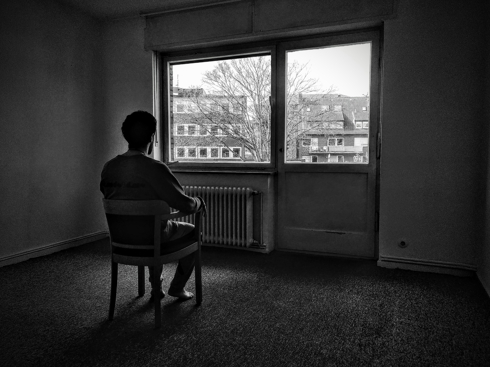
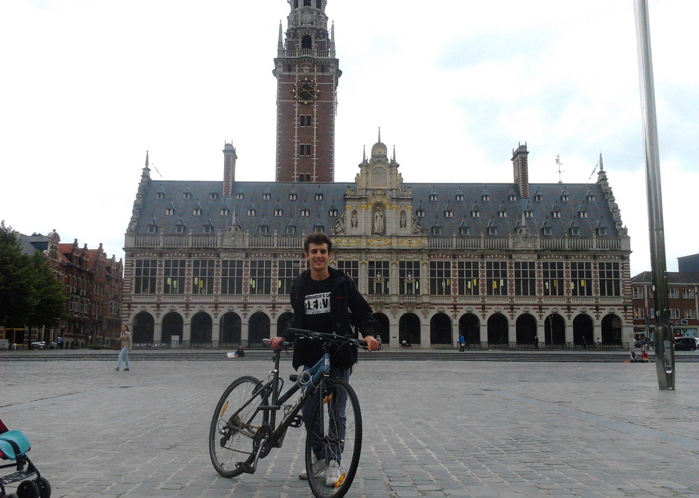

--- 
title: "From my lovers and others. (Letters from 2013-2014)"
author: "Carlos Alcala a.k.a. [Carlito Fluito](www.carlitofluitoideas.com)"
date: "`r Sys.Date()`"
site: bookdown::bookdown_site
documentclass: book
bibliography: [bibliography.bib]
biblio-style: apalike
output:
  pdf_document:
    toc: true
    toc_depth: 2
link-citations: yes
github-repo: carlitofluito/letters2013_14
description: "This is a compendium of the letters written, sent and received between October 2013 and September 2014."
---

# Preamble {-#preamble}

We are socially fragmented. 

Memory, knowledge, lives, even identities. Everything is dispersed (another argument supporting the non-local consciousness theory). 

The aim of this epistolary work is to know a bit better what I am now thorugh the compilation of pieces of what I have been. I have been told in the past that there was wisdom in the texts I wrote, and I am sure that there is wisdom in the texts I received.

I hope you find something that makes your life more meaningful and satisfactory. I hope you find a bunch of human beings that, like you, have suffered and have enjoyed moments of their lives. A bunch of human beings that, after all, have lived.


### If you don't know me... {-#intro}

If this is the first time you find out about me, I am Carlos Alcala a.k.a. Carlito Fluito. I like sharing my ideas and experiences through [writing](www.carlitofluitoideas.com), [performing](www.carlitofluito.com), sporadic [YouTube videos](https://www.youtube.com/channel/UC5Q8igPq_lE1JQNwbjjy7wA), and spontaneous [Instagram posts](https://www.instagram.com/carlitofluito/?hl=en).

```{r intro, fig.cap= " *Munster (Germany). March, 2020*: It took me a while to take this picture with my [Fairphone](https://www.fairphone.com/en/) and an improvised tripod. I like the result, though.", fig.margin = TRUE, out.width = "75%", fig.align='center', echo=FALSE}

```

The seriousness of my content varies from "*This guy is crazy!*" to "*It makes sense what he's saying...*". In any case,  As any other human being, I have needs to survive. If you find value in anything I do, and you want to keep me alive^[Or help me growing, let's not be so dramatic.], I will be extremelly grateful if you support me on [Patreon](https://www.patreon.com/carlitofluito)^[I am also a qualified psychologist, running online counseling and coaching sessions. Feel free to contact if you are interested in working together.], or drop me a "*Thanks for creating*" message. 

Best, and enjoy reading!!

## A bit of context {-#context}

In September 2013, I moved to Leuven (Belgium) to study my fourth and last year of Bachelor in Psychology. Many people warned me about the dangers of getting lost in the wild parties of the city, and how much a year as Erasmus student could teach me about the world. However, no one warned me about the perils I would encounter, or about how one given evening could actually change my whole life, being, and spirit… 

```{r library, fig.cap= " *Leuven (Belgium). July, 2013*: Before the course started, I went to Leuven to find a place to live during the year. Not only, I found the room, but also a nice bike that still waits for me when I go to Valladolid (Spain). This is the triumphant hunting picture with the prize.", fig.margin = TRUE, out.width = "75%", fig.align='center', echo=FALSE}

```